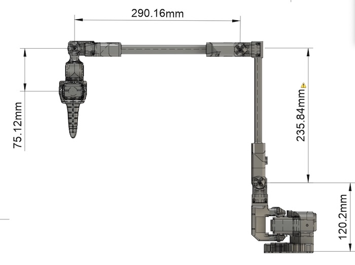

# PingTi Arm - A Low-Cost Robotic Arm with Human Arm Length 🤖💪

### Why PingTi Arm? 🤔

`SO-100` is a great low-cost open source robotic arm and Lerobot is a fantastic AI for Robotics open source project. But `SO-100` has below limitations:

- **Short arm span**, which makes it almost a toy and hardly to do practical work with its span length 
- **Light payload**, which makes it really hard to do a simple work like picking a bootle of water

In short, we need to buy long and high payload robotic arms in order to seriously study the state-of-the-art AI for robotics (pi0, OpenVLA etc.), and these robotic arms are usually expensive.

### What is PingTi Arm ✨

A low-cost open source arm based on `SO-100` and addresses its 2 limitations by introducing:

- **Human arm length 🦾**. By extending the lower and upper arms of the SO-100, PingTi Arm now boasts a 65cm span length—comparable to a human arm! This makes it far more practical for real-world applications.

- **Reasonable payload 💪**. To handle heavier loads, I've upgraded the key joints (shoulder_lift and wrist_lift) with dual powerful servos. This not only increases torque but also ensures smoother and more stable motion control.

### URDF

A PyBullet URDF is created by using [Fusion2PyBullet](https://github.com/yanshil/Fusion2PyBullet/tree/master) , see `./urdf/PingTi_Arm_pybullet/`