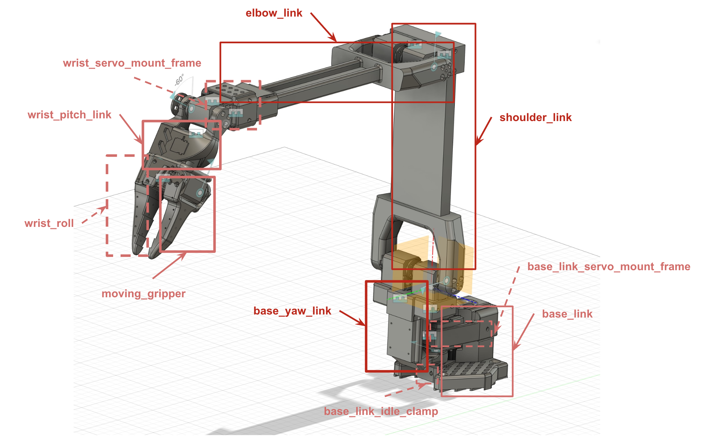
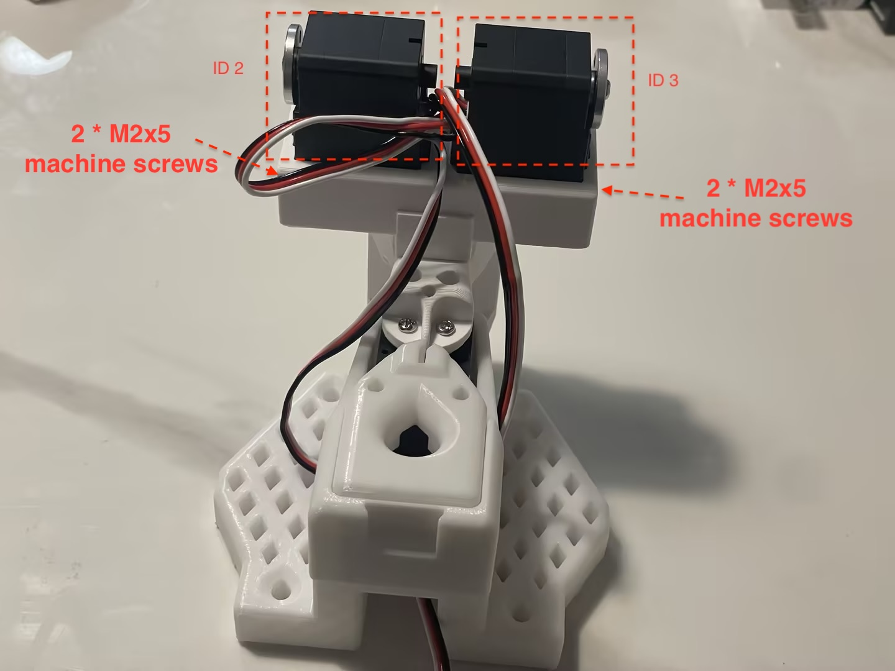

## Placement of Servos

There are 8 servos, including 2 * ST-3250 (50kg.cm) servos and 6 * ST-3215 (30kg.cm) servos, and the placement of servos can be found below:


## Placement of Links

There are 10 links and the placement for different links can be found below:



## Configure Servos using LeRobot

### A. Install LeRobot library and Find USB port

Refer the **Install LeRobot** section of offical [LeRobot tutorial](https://github.com/huggingface/lerobot/blob/main/examples/10_use_so100.md#b-install-lerobot) 

You should also find the USB port by following instructions of **Find the USB ports associated to each arm** in [LeRobot tutorial](https://github.com/huggingface/lerobot/blob/main/examples/10_use_so100.md#1-find-the-usb-ports-associated-to-each-arm)

### B. Configure the servos using LeRobot

Below script demos how to configure servo. The configuration script will do 2 things:
1. Set the servo's id as `1`
2. Set the position of the servo to `2048`

```bash
python lerobot/scripts/configure_motor.py \
  --port /dev/tty.usbmodem58760432961 \
  --brand feetech \
  --model sts3215 \
  --baudrate 1000000 \
  --ID 1
```

Then unplug your servo and plug the second servo (it should be a ST3250 servo) and set its ID to 2. **Here you can keep using the `--model sts3215` since both model types shares the same SDK and control table.**

```bash
python lerobot/scripts/configure_motor.py \
  --port /dev/tty.usbmodem58760432961 \
  --brand feetech \
  --model sts3215 \
  --baudrate 1000000 \
  --ID 2
```

Redo the process for all your motors until ID 8. Please note that the IDs for 2 ST-3250 servos should be **2** and **3**. You can also see servo placement drawing above for reference.

### C. Add motor horn to all 8 servos
You can refer to LeRobot official video for adding the motor horn to all 8 servos. The video can be found here [Add Motor Horn to servos](https://www.youtube.com/watch?v=FioA2oeFZ5I&list=PLo2EIpI_JMQu5zrDHe4NchRyumF2ynaUN&index=8&t=570s) 

## Assemble of PingTi Aarm

### Assemble of Base
See SO-ARM100 assemble video for the assembly of base links with servo (ID 1). Specifically, you should look at the **Step4.1 to Step4.4** in [this video](https://www.youtube.com/watch?v=FioA2oeFZ5I&list=PLo2EIpI_JMQu5zrDHe4NchRyumF2ynaUN&index=9&t=610s)

### Assemble of Shoulder
**Connecting wires to servos** The shoulder joint consists of 2 `ST-3250` servos and you should connect all 4 wires before putting the servos into slots, see image below. 


**Putting servos into slots of base_yaw_link** Put the `ID 2` servo on the left slot and `ID 3` servo on the right slot. See image below




**Attaching shoulder link to servo horns** Use 8 M3x6 machine screws to attach shoulder link to servo horns. Pls note the shoulder link should be vertically attached to the servo horns and servo horns on its end should face forward. See image below.


### Assemble of Elbow
**Connecting wires to servos** The elbow joint consits of 2 `ST-3215` servos with `ID 4` and `ID 5`. You should connect wires properly before putting servos into slot. See image below


**Putting servos into slots and attache elbow link** Put the `ID4` and `ID5` into servo slots like image below. Also attach the elbow link to servo horns using 8 M3x6 machine screws


### Assemble of Wrist and Gripper
See SO-ARM100 assemble video for the assembly of wrist links, gripper links and servos (you would use servos with id 6, 7 and 8). 

Specifically, you should start from **Step 4.9 to Step 4.12** in [this video](https://www.youtube.com/watch?v=FioA2oeFZ5I&list=PLo2EIpI_JMQu5zrDHe4NchRyumF2ynaUN&index=11&t=669s)

## Assemble of SO-ARM100 Leader Arm
See the [SO-ARM100 assemble video for Leader Arm](https://www.youtube.com/watch?v=FioA2oeFZ5I&list=PLo2EIpI_JMQu5zrDHe4NchRyumF2ynaUN&index=12&t=707s)

