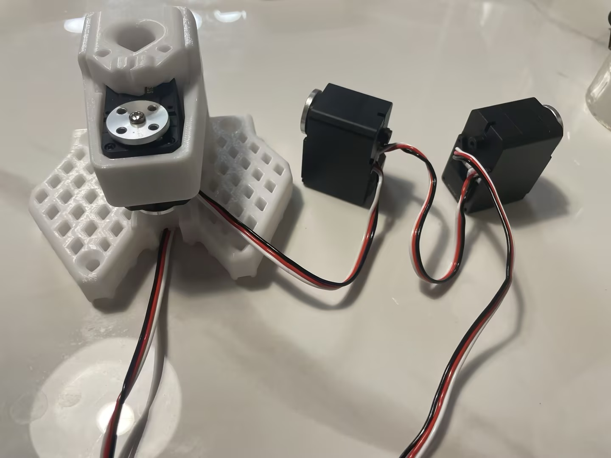
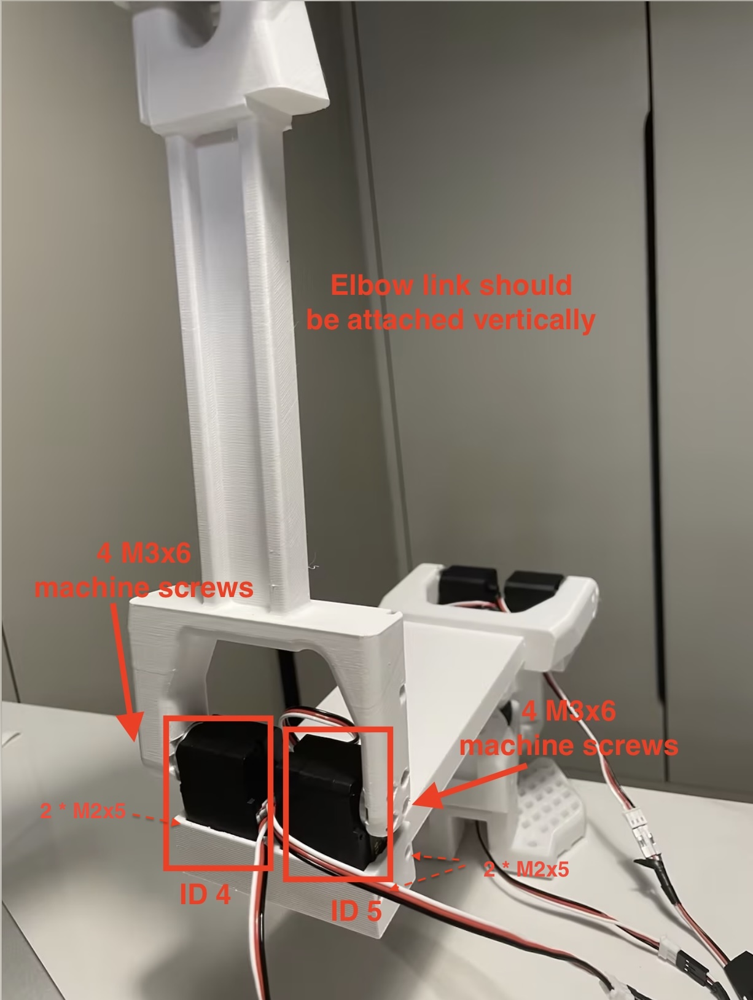

## 舵机放置

PingTi arm 共有8个舵机，包括2个ST-3250（50kg.cm）舵机和6个ST-3215（30kg.cm）舵机，舵机的放置位置如下：


## 连杆放置

PingTi arm 共有10个连杆，不同连杆的放置位置如下：


## USB 板连接

请参考下方图片连接电源和舵机。

> **注意**：`V1` 端口标注为 `DC6V-9V`，但经过咨询 Feetech 技术支持，确认可以安全连接 12V 电源。


## 使用LeRobot配置舵机

### A. 安装LeRobot库并查找USB端口

参考官方[LeRobot教程](https://github.com/huggingface/lerobot/blob/main/examples/10_use_so100.md#b-install-lerobot)中的**安装LeRobot**部分。

您还应按照[LeRobot教程](https://github.com/huggingface/lerobot/blob/main/examples/10_use_so100.md#1-find-the-usb-ports-associated-to-each-arm)中的**查找与每个机械臂关联的USB端口**部分的说明查找USB端口。

### B. 使用LeRobot配置舵机

以下脚本演示了如何配置舵机。配置脚本将执行以下两个任务：
1. 将舵机的ID设置为`1`
2. 将舵机的位置设置为`2048`

```bash
python lerobot/scripts/configure_motor.py \
  --port /dev/tty.usbmodem58760432961 \
  --brand feetech \
  --model sts3215 \
  --baudrate 1000000 \
  --ID 1
```

然后拔下您的舵机并插入第二个舵机（第二个舵机应为`ST-3250`舵机），并将其ID设置为`2`。这里您可以继续使用`--model sts3215` 参数，因为两种型号共享相同的SDK和控制表。

```bash
python lerobot/scripts/configure_motor.py \
  --port /dev/tty.usbmodem58760432961 \
  --brand feetech \
  --model sts3215 \
  --baudrate 1000000 \
  --ID 2
```

重复此过程，直到所有舵机的ID设置为8。请注意，2个ST-3250舵机的ID应为`2`和`3`。您也可以参考上面的舵机放置图。

### C. 为所有8个舵机安装舵盘

您可以参考LeRobot官方视频为所有8个舵机安装舵盘。视频链接如下：[Add Motor Horn to servos](https://www.youtube.com/watch?v=FioA2oeFZ5I&list=PLo2EIpI_JMQu5zrDHe4NchRyumF2ynaUN&index=8&t=570s) 

## PingTi机械臂组装

### Base 组装
参考SO-100组装视频，组装base link 与舵机（ID `1`）。具体来说，您应查看[此视频](https://www.youtube.com/watch?v=FioA2oeFZ5I&list=PLo2EIpI_JMQu5zrDHe4NchRyumF2ynaUN&index=9&t=610s)中的**Step 4.1到Step 4.4**。

### Shoulder 组装
**连接舵机线缆** Shoulder 关节由2个`ST-3250`舵机组成，您应在将舵机放入槽位之前连接所有4根线缆，如下图所示。  


**将舵机放入base_yaw_link的槽位** 将`ID 2`舵机放在左侧槽位，`ID 3`舵机放在右侧槽位。使用4个M2x5螺丝固定舵机。如下图所示  


**将肩部连杆连接到舵机臂** 使用8个M3x6机器螺钉将 Shoulder link 连接到舵盘。请注意，Shoulder link 应垂直连接到舵盘，且Shoulder link 末端的舵机槽应朝前。如下图所示。


### Elbow 组装
**连接舵机线缆** Elbow 关节由2个`ST-3215`舵机组成，ID分别为`ID 4`和`ID 5`。您应在将舵机放入槽位之前正确连接线缆。如下图所示  


**将 Shoulder link 槽位并连接肘部连杆** 如下图所示，将`ID4`舵机放入左侧槽位，`ID5`舵机放入右侧槽位，使用4个M2x5螺丝固定舵机。同时使用8个M3x6机器螺钉将 Elbow link 连接到舵盘。



### Wrist & Gripper 组装
参考SO-100组装视频，组装腕部连杆、夹爪连杆和舵机（您将使用ID为6、7和8的舵机）。  

具体来说，您应从[此视频](https://www.youtube.com/watch?v=FioA2oeFZ5I&list=PLo2EIpI_JMQu5zrDHe4NchRyumF2ynaUN&index=11&t=669s)中的**步骤4.9到步骤4.12**开始。

## SO-100主控机械臂组装
参考[SO-100主控机械臂组装视频](https://www.youtube.com/watch?v=FioA2oeFZ5I&list=PLo2EIpI_JMQu5zrDHe4NchRyumF2ynaUN&index=12&t=707s)

## Footnote

在 Bilibili 也可以找到 SO-100 相关的组装教程，例如 [30分钟装好SO-100-保姆级视频组装教程-从臂](https://www.bilibili.com/video/BV1CNNoeeEpJ/?spm_id_from=333.337.search-card.all.click&vd_source=2e4ecddcf1639d3485e2196c66390b81)


