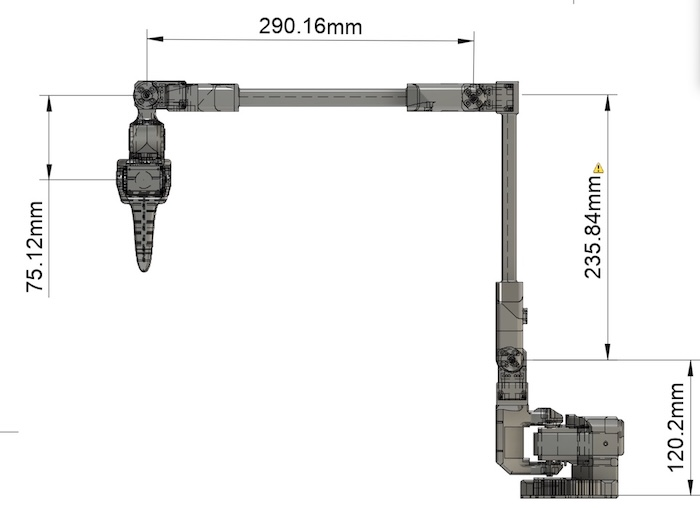

# PingTi Arm - A Low-Cost Robotic Arm with Human Arm Length 🤖💪

## 什么是 PingTi Arm？🤔
PingTi 机械臂基于 [SO-ARM100 机械臂](https://github.com/TheRobotStudio/SO-ARM100) 设计，并与 [Lerobot](https://github.com/huggingface/lerobot) 兼容。PingTi, 即“平替”的拼音。

### Features
- **人类臂长尺寸**：臂展为 660mm（不包括末端执行器）。
- **合理的负载能力**：在最大臂展下支持高达 550g 的负载。
- **低成本**：
    - 单个 PingTi 机械臂的成本约为 **1800元人民币**，
    - 一对主从机械臂（PingTi 机械臂作为从臂，SO-ARM100 作为主臂）的组装成本为 **2486元人民币**。
    - 如果你已经组装了一只 SO-ARM100 从动臂(使用12V, 30kg.cm 舵机)，那么你只需要再买2个舵机，一个USB驱动板 (973元)，就可以组装 PingTi Arm

### Docs
- [物料清单(淘宝链接版)](./BOM_List_CN.md)
- [3D打印](./3d_print.md)
- [组装教程](./Assemble_tutorial_CN.md)
- 运行遥操作
- [用于仿真的 URDF 文件](./docs/URDF_SIM.md)

