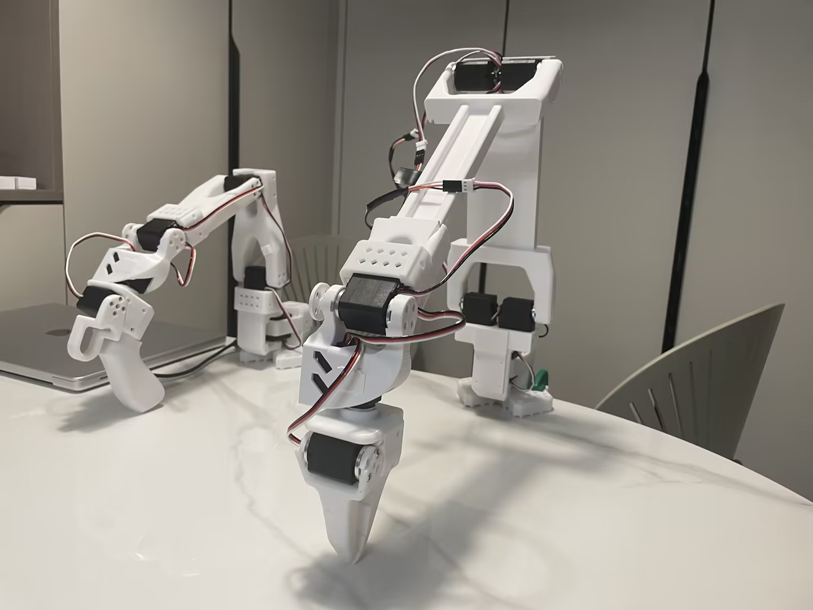

# PingTi Arm - A Low-Cost Robotic Arm with Human Arm Length 🤖💪

## 什么是 PingTi Arm？🤔
PingTi 机械臂基于 [SO-100 机械臂](https://github.com/TheRobotStudio/SO-ARM100) 设计，并与 [Lerobot](https://github.com/huggingface/lerobot) 兼容。PingTi, 即“平替”的拼音。

## Features
- **人类臂长尺寸**：臂展为 660mm（不包括末端执行器）。
- **合理的负载能力**：在最大臂展下支持高达 550g 的负载。
- **支持设置主从臂**: 你可以使用SO-100 作为主臂，PingTi Arm作为从臂
- **Lerobot 兼容**: 你可以通过使用 [pingti_lerobot_bridge](https://github.com/nomorewzx/pingti_lerobot_bridge)` sdk 运行遥操作, 数据收集等任务
- **低成本**：
    - 单个 PingTi 机械臂的成本约为 **1800元人民币**，
    - 一对主从臂的组装成本为 **2486元人民币**。
    - 如果你已经组装了一只 SO-100 从动臂(使用12V, 30kg.cm舵机)，那么你只需要再买2个舵机，一个USB驱动板 (973元)，就可以组装 PingTi Arm

## Docs
- [物料清单(淘宝链接版)](./BOM_List_CN.md)
- [3D打印](./3d_print.md)
- [组装教程](./Assemble_tutorial_CN.md)
- 运行遥操作
- [用于仿真的 URDF 文件](./docs/URDF_SIM.md)

## 初学者推荐

- 强烈建议初学者从 [SO-100](https://github.com/TheRobotStudio/SO-ARM100) 开始，如果对以下内容感兴趣，可以过渡到 PingTi 机械臂：
    - 更长的机械臂
    - 合理的负载能力

- 如前所述，如果您使用 `12V 30KG.cm` 舵机组装 SO-100，只需再购买 2 个舵机和 1 个 USB 控制板即可过渡到 PingTi 机械臂。不会有任何资金浪费。

## 注意事项⚠️
- 避免重负载（例如 600g）情况下进行突然运动和停止。
- 如果不注意这些条件，可能会导致肩关节损坏。
- 如果计划频繁使用重负载，建议在打印机械臂连接件时增加**填充密度**。

## 致谢

- [SO-100](https://github.com/TheRobotStudio/SO-ARM100)
- [Lerobot](https://github.com/huggingface/lerobot)
- [LeKiwi](https://github.com/SIGRobotics-UIUC/LeKiwi)